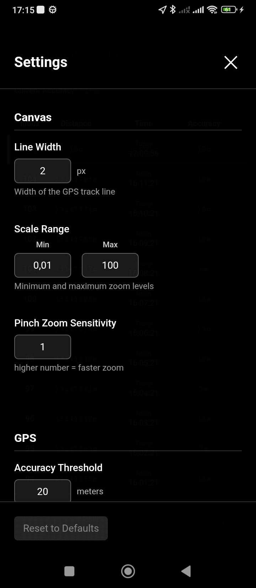

# GPS Pen

This app explores surveillance and self-surveillance through minimalist GPS tracking. By reducing the interface to pure movement visualization.

Built with Vue 3 + Capacitor for cross-platform deployment with privacy-first, local data storage.

## Features

- **GPS Drawing**: Continuous real-time GPS drawing with background support if app is minimized or mobile locked
- **Export Options**: 
  - **SVG Export**: Save the current drawing as a scalable SVG file
  - **Relative Coordinates**: coordinates relative to starting point
  - **Exact Coordinates**: Real GPS coordinates (latitude/longitude)

## app preview

| Home Screen | GPS Points View | Settings |
|-------------|-----------------|----------|
|  |  |  |

## License

MIT License - see [LICENSE](LICENSE) file for details.
